

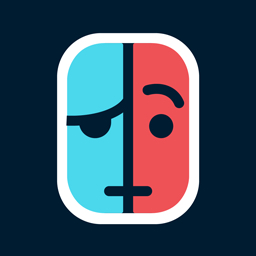

# <b>Linkalho</b>

Linkalho is an homebrew app that will link NNID accounts offline. It links (or unlinks) <b>existing</b> accounts so you won't lose your saves.
This app does not create new accounts. If you create a new account and want to link it, just re-run the app.

 

## <b>Why do I need this app?</b>
If you never had issues with games/apps failing to launch until you link your Switch user account and you never experienced issues with certain titles stuck in _Updating game data_ or certain official emulators presenting you with nothing else but a black screen instead of the game selection, then you don't need to use this homebrew.

 

Do you like this app and find it useful? You can buy me a coffee clicking the link below. Thanks! 

 

## <b>Frequently Asked Questions</b>:
- Why can't I navigate the app via touchscreen or using the thumbs ticks?
  - This is a very simple and straightforward app that most users will only use once or twice. Unless Borealis developers implement this natively, there are no plans for me to extend their feature set.

- Can I go online with a fake/generated linked account?
  - No! You have a hacked switch. Online is always a risk.

- Can this app do "place whatever question here"?
  - You can start by reading the [previous section](https://github.com/rdmrocha/linkalho#why-do-i-need-this-app). This app will allow you to link/unlink a fake/generated NNID to your user accounts without the need for an internet connection, and that's it. If you still fail to understand what this is and its purpose, it's highly likely that you simply don't need this app. Worry not: if you ever need it, you'll know it.

 

## <b>Installation</b>:
- Place the .nro file in the `/switch/linkalho` folder of your SDcard.
- Go to the homebrew app and run Linkalho

 

### <u>Reboot to payload</u>
After completing the selected operation, Linkalho will reboot to an existing payload if:
- the console hardware is Erista and the user places a payload file in the application's root (`/switch/linkalho/reboot.bin`)

Reboot to payload is not supported on Mariko hardware!
 

## <b>Usage</b>:

### <u>Link selected accounts</u>
- Will link all selected accounts from the ones present on the console. If any of the existing accounts is already linked, it will be re-linked (regardless of the NNIDs being officially linked or not).
This operation creates a backup in `/switch/linkalho/backups`

### <u>Unlink selected accounts</u>
- Will remove NNID linking from any of the selected accounts on the console regardless of the NNIDs being officially linked or not.
This operation creates a backup in `/switch/linkalho/backups`

### <u>Restore backup</u>
- Restores any previous state from a backup file. The file must be placed in `/switch/linkalho/restore/restore.zip`. If not present, the UI will notify the user.
This operation creates a backup in `/switch/linkalho/backups`

### <u>Create manual backup</u>
- Will create a backup in `/switch/linkalho/backups`.
All linking and unlinking operations will automatically produce a backup before making changes.
<b>You should only use this option if you want to manually create a backup!</b>

### <u>Select country for linked accounts</u>
- Allows the user to customize the country that will be injected into the linked account. This has impact in some software by showing the appropriate flag (like in mk8).

### <u>Select accounts to link/unlink</u>
- Allows the user to pick which accounts are going to be linked/unlinked. It defaults to **_all_**. If no accounts are selected and the user tries to perform a link or unlink operation, the application will show an error.

 

## <b>Screenshots</b>

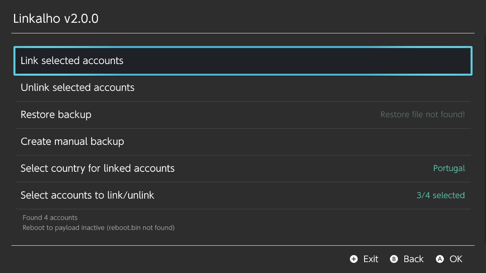

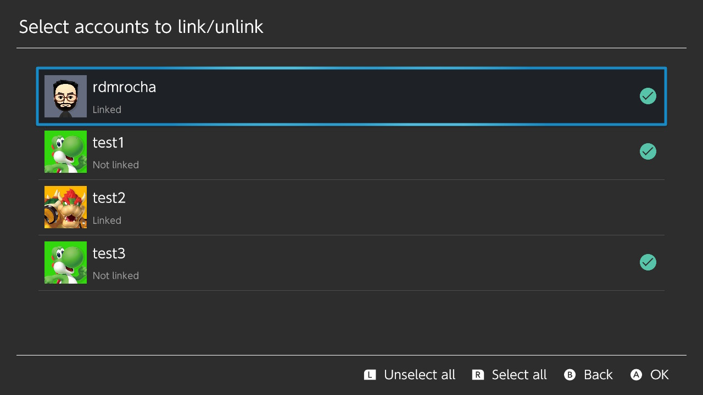

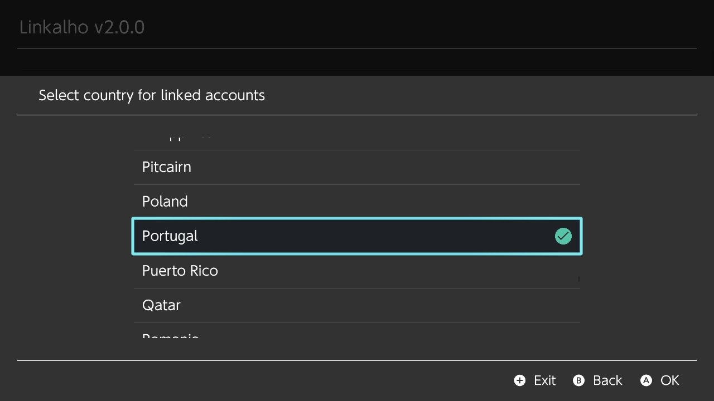

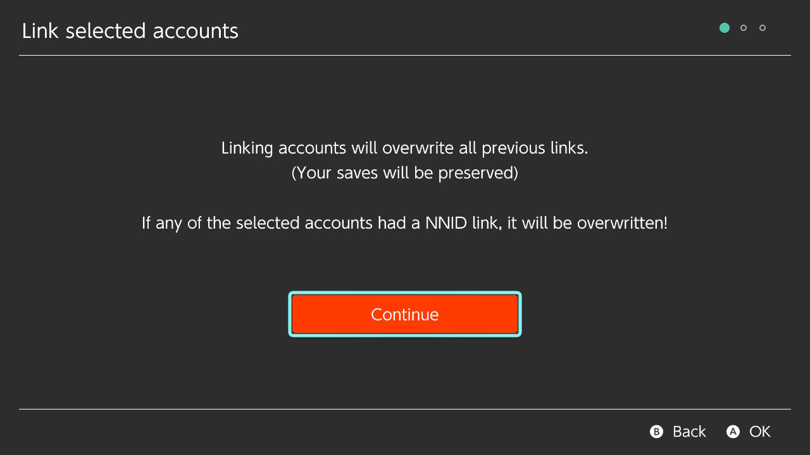

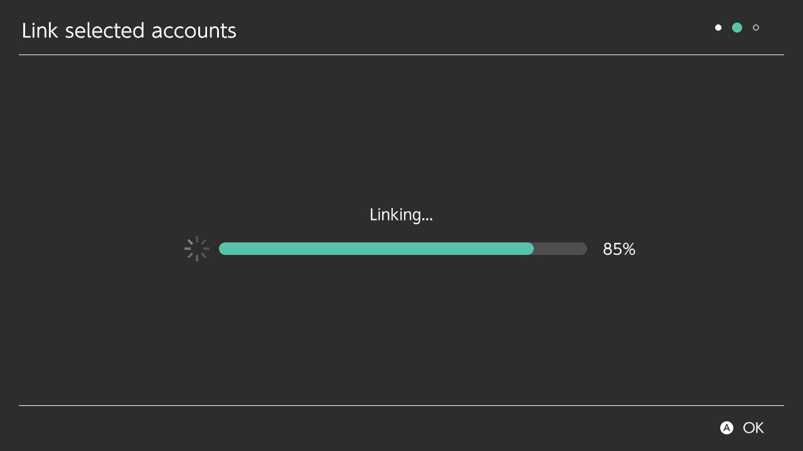

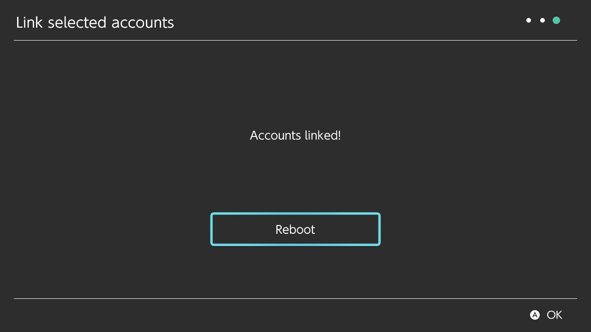

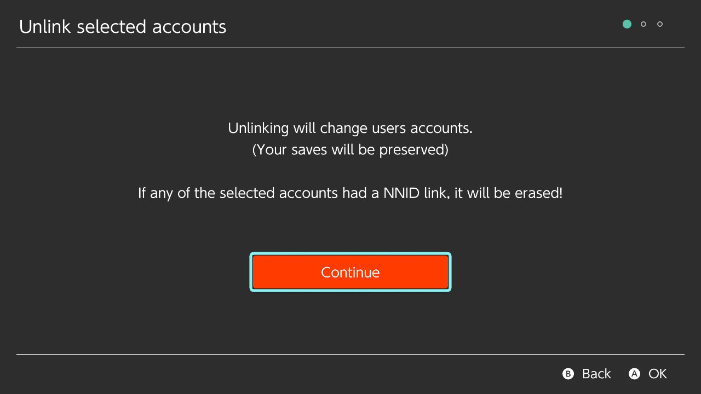

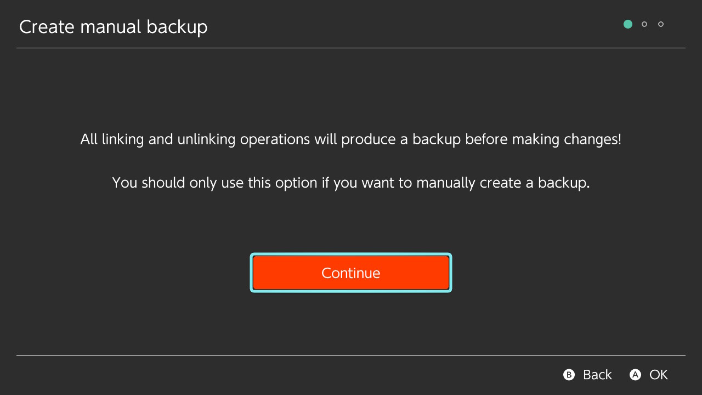

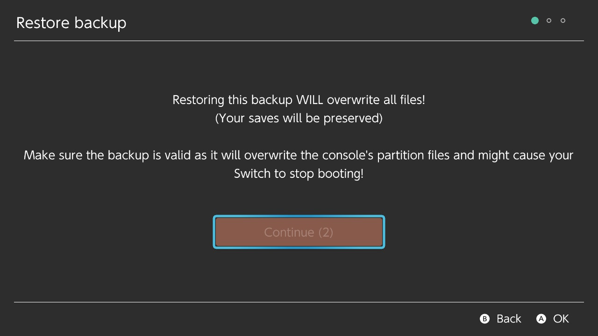

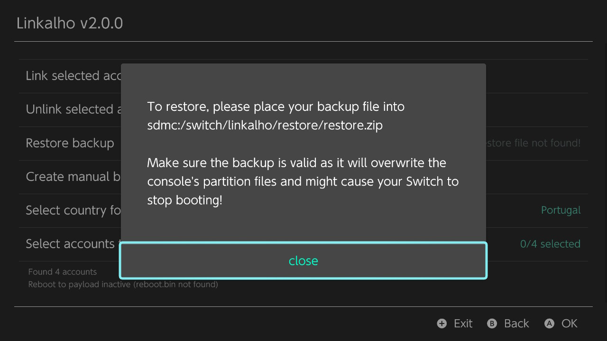

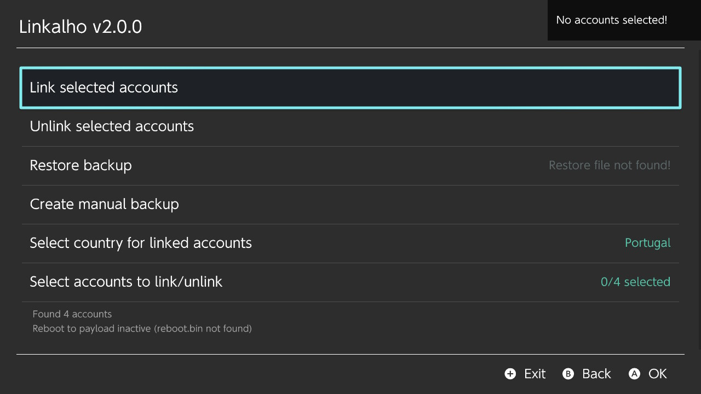

 

## <b>Credits</b>
  - [devkitPro](https://devkitpro.org) for the toolchain!
  - [natinusala (lib borealis)](https://github.com/natinusala/borealis) for the amazing library that mimicks the Switch's original UI and UX
  - [sebastiandev (zipper wrapper for minizip)](https://github.com/sebastiandev/zipper/) for their nice wrapper to the minizip
  - [Kronos2308](https://github.com/Kronos2308) for the help in the initial phases of research.
  - [SciresM](https://github.com/SciresM) for his "reboot to payload" code and [HamletDuFromage](https://github.com/HamletDuFromage) for the code contributions
  - **target** for the icon, the beta testing and for supplying crucial files that helped in the creation of the generators.
  - **boredomisacrime** for the beta testing.
